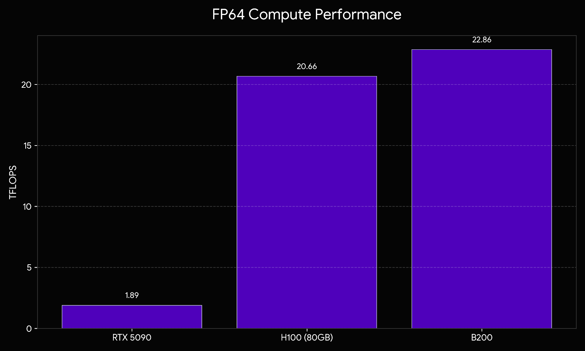
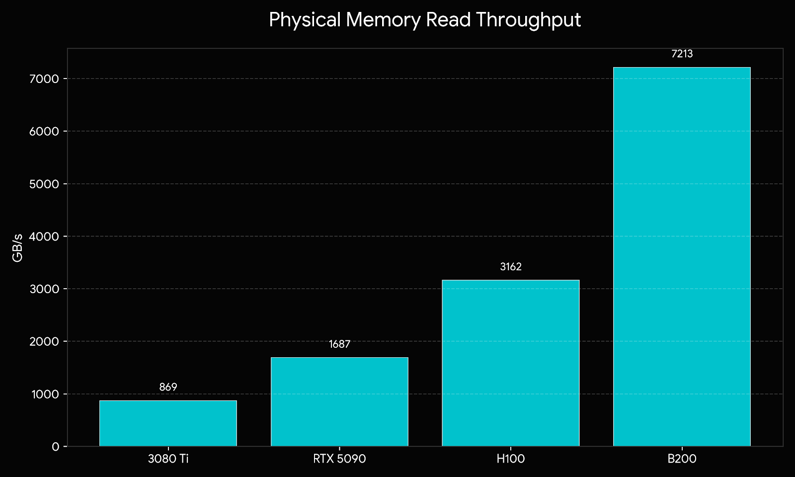
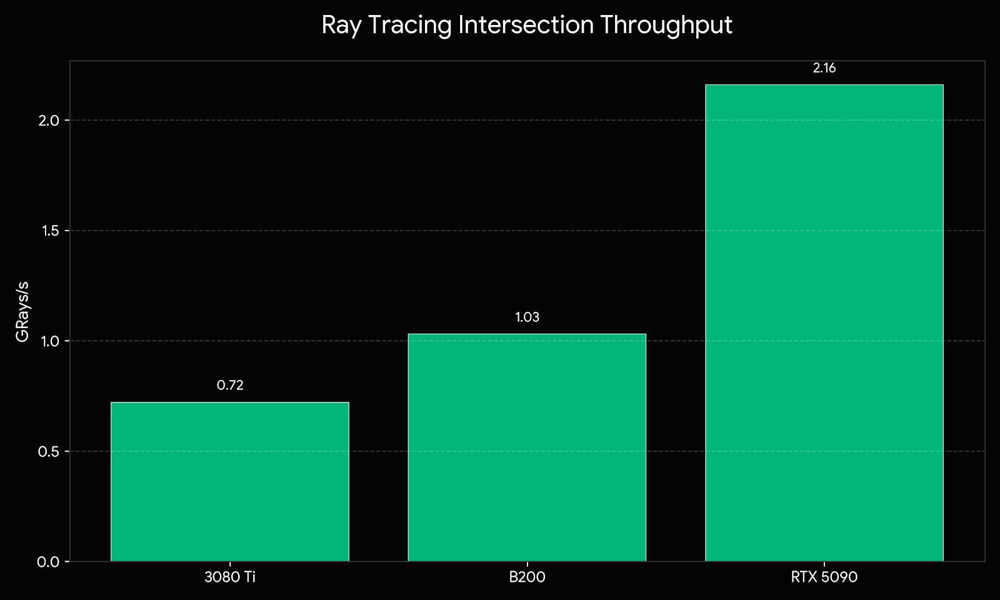

# Silicon Segregation: What Low-Level Telemetry Reveals About Enterprise vs. Consumer GPUs

''

When NVIDIA drops a new flagship consumer GPU, the gaming community focuses on raw frame rates. The new RTX 5090 is an absolute behemoth. But how does that $2,000 consumer card actually compare to a $40,000 enterprise data center chip like the NVIDIA B200 or the H100?

To find the actual physical differences forged into the silicon, we deployed **Pantheon**—a diagnostic suite designed to bypass driver abstractions and directly attack specific hardware subsystems. Here is what happens when you strip away the marketing and measure the physics.

## 1. The FP64 Chasm: Artificial Silicon Fusing

While AI relies on low-precision math, scientific modeling demands **Double Precision (64-bit float)**. Pantheon's `fp64_virus` floods the die with unrestricted FMAs to expose how aggressively manufacturers segment their markets.

**The Consumer Lockdown:** The RTX 5090 is an incredibly powerful chip, but it flatlines under FP64 workloads. NVIDIA artificially fuses off these datapaths via microcode to protect their enterprise segment.

## 2. The Memory Architecture: GDDR7 vs. HBM3e

Consumer GPUs rely on standard GDDR memory, while enterprise GPUs use **High Bandwidth Memory (HBM)** physically stacked directly on the silicon package. 

**Enterprise (HBM):** Those consumer numbers look like child's play next to the data center cards. The B200 (HBM3e) achieved a mind-bending **7,213 GB/s** of true physical read throughput in our testing.

## 3. The Ray Tracing Advantage: Where Consumer Silicon Wins

Enterprise dies don't sweep every category. By running Pantheon's `rt_virus`, which floods dedicated RT cores with billions of non-coherent ray-triangle tests, we measured the physical die area dedicated to graphics.

The RTX 5090 absolutely annihilated the enterprise hardware here, pushing triple the throughput of the older RTX 3080 Ti. NVIDIA invests significantly in fixed-function rendering for the consumer market.

## 4. Thermal Realities: Vapor Chambers vs. Liquid Cooling

Running isolated power viruses like `sfu_stress` exposes the reality of the cooling solutions required to keep these chips from melting.

* **RTX 5090:** During testing, it drew a staggering **584.8 Watts**, yet its massive vapor chamber kept the core at a chilly **54.0°C**. 
* **RTX 3080 Ti:** Hit **83.0°C** while drawing significantly less power (**348.9W**). 
* **Enterprise Efficiency:** The flagship B200 showcased the raw power of direct-to-chip liquid cooling, peaking at a maximum of just **47.0°C** under the heaviest combinatorial workloads.

## The Takeaway

When you dive into the low-level silicon telemetry, the segregation is absolute. Consumer hardware is artificially bottlenecked in precision and memory but reigns supreme in fixed-function graphics. Enterprise hardware is a memory-bandwidth monster designed for years of 100% capacity under liquid cooling.

**Run Pantheon on your own system:** 🔗 [https://pantheongpu.com/](https://pantheongpu.com/)
